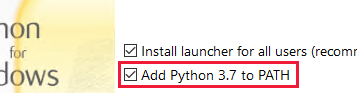

# Lars vs Scrapie challenge plots and graphs

This project provides a few python scripts to analyze the data from the 1000 AT challenge between Lars and Scrapie, and displays this data using some graphs (some are even interactive yayy).

## Requirements

- Python 3.x
- Required Python libraries: pandas, matplotlib, numpy, mpld3

## Quick Setup Instructions

### 1. Install Python

If you don't have Python installed, download and install it from the official website:
- [Download Python](https://www.python.org/downloads/)
- [Direct Python 3.13 download link](https://www.python.org/ftp/python/3.12.8/python-3.12.8-amd64.exe) (note: this is the windows edition)

Make sure to add Python to your system's PATH during installation.


### 2. Clone or Download the Repository

Download this repository to your local machine and navigate to its directory in your terminal or command prompt.

### 3. Install Required Packages

Once Python is installed, use pip to install the necessary libraries. In your terminal, run:
```bash
pip install -r requirements.txt
```

### 4. Run the scripts

You can now run `start.py` to run a minimal no-interface way to open the different files. (Run the file by right clicking the file, clicking `open width` and selecting `python`)
Or you can run the `start_GUI.py` to open a window where you can click instead xdd 
